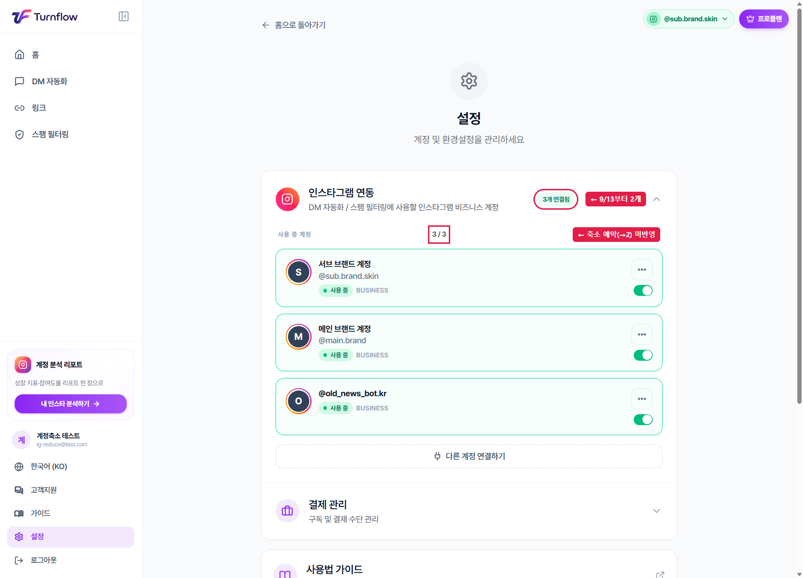
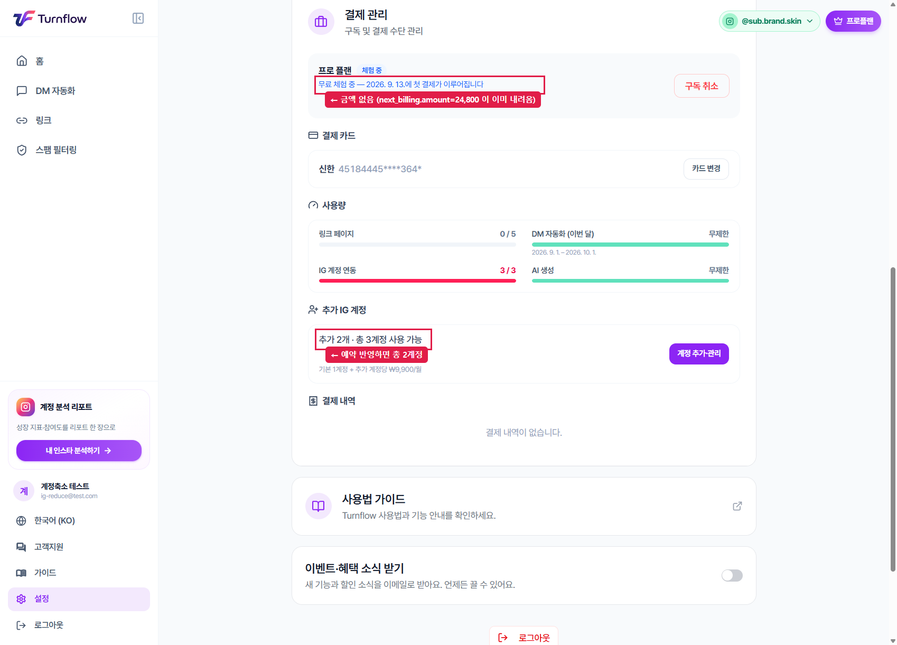
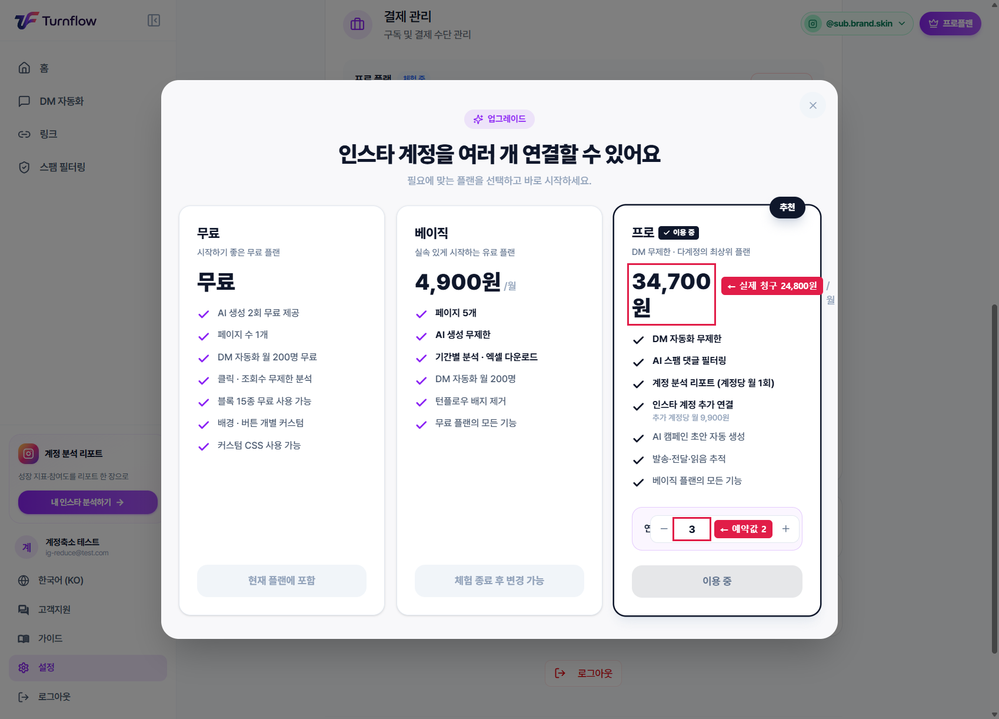
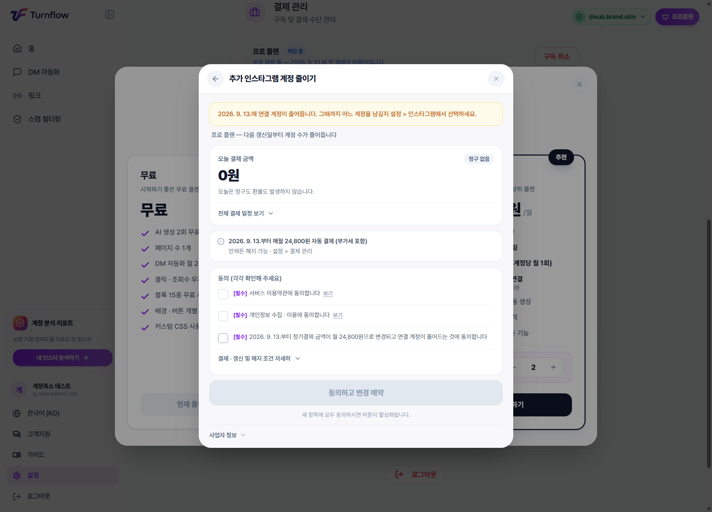
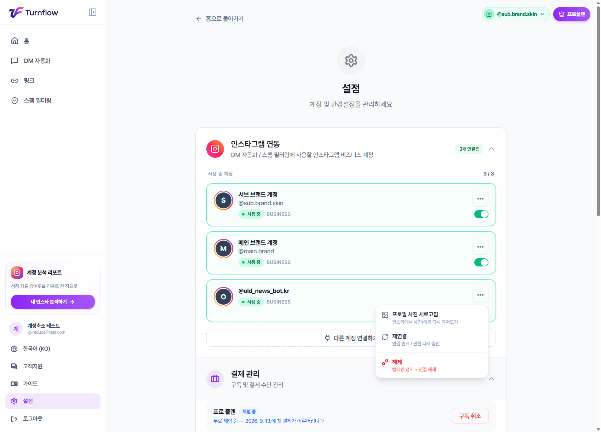

# [프론트 요청] 추가 IG 계정 "축소 예약"이 화면에 전혀 안 보입니다 — CS #d34572b3

작성 2026-09-05 · 백엔드 · **백엔드 변경 없음 / 프론트 표시 문제**
아래 캡처는 전부 **dev에서 축소 예약을 실제로 완료한 뒤 새로고침한 상태**입니다.
따로 재현하실 필요 없습니다. (원하시면 §6에 계정 있습니다)

---

## 1. 한 줄 요약

추가 IG 계정 축소는 **다음 결제일부터** 적용되는데, 예약이 걸린 뒤에도 화면이 전부
**"3개 / 34,700원"** 이라고 말합니다. 고객은 자기가 누른 게 먹혔는지 알 방법이 없어
같은 조작을 반복하다 CS로 옵니다.

필요한 값(`pending_extra_ig_accounts`, `renewal_amount`, `next_billing`)은
**이미 API 응답에 내려가고 있습니다.** 화면에 그리기만 하면 됩니다.

**아래 캡처 3장의 서버 상태(동일):**

```jsonc
// GET /api/v1/billing/my-subscription/
{
  "status": "trialing",
  "extra_ig_accounts": 2,            // 지금 적용 중 → 총 3계정
  "pending_extra_ig_accounts": 1,    // ★ 축소 예약 → 갱신일부터 총 2계정
  "current_period_end": "2026-09-13T01:01:00+09:00",
  "renewal_amount": 24800,
  "next_billing": { "date": "2026-09-12T16:01:00Z", "amount": 24800 }
}
```

---

## 2. 문제 캡처 (빨간 표시가 어긋난 지점)

### ① 설정 → 인스타그램 연동



- `3개 연결됨` · `사용 중 계정 3 / 3` — 9/13부터 2개가 되는데 **예약 흔적이 없습니다.**
- 고객이 "어느 계정을 뺄지" 골라야 하는 화면이 바로 여기인데, **여기서는 줄어든다는 사실
  자체를 알 수 없습니다.**

### ② 설정 → 결제 관리



| 지점 | 지금 표시 | 실제 |
|---|---|---|
| 체험 안내 | `2026. 9. 13.에 첫 결제가 이루어집니다` | **금액이 빠져 있음** — `next_billing.amount = 24800` |
| 사용량 → IG 계정 연동 | `3 / 3` | 갱신 후 `2 / 2` |
| 추가 IG 계정 | `추가 2개 · 총 3계정 사용 가능` | 예약 반영 시 **총 2계정** |

### ③ 요금제 모달 (결제 관리 → [계정 추가·관리])



- 가격 **`34,700원`** = `14,900 + 9,900 × extra_ig_accounts(2)` 로 클라에서 재계산한 값.
  **실제 다음 청구는 24,800원**입니다.
- 스테퍼가 **`3`** — 고객이 방금 2로 예약했는데 3으로 되돌아와 있습니다.

**→ 여기서 루프가 완성됩니다.** 고객: "2로 줄였는데 왜 3에 34,700원이지?" → 다시 2로 내림
→ 또 예약됨 → 모달 닫으면 또 3 → 반복. prod 티켓 #d34572b3 이 정확히 이 상태였습니다.

---

## 3. 이미 잘 되어 있는 부분 (바꾸지 마세요)

### 축소 확인 모달



적용일 · 오늘 청구 0원 · 다음 청구 금액 · 3단 동의까지 완벽합니다.
특히 이 문장이 정답입니다:

> 2026. 9. 13.에 연결 계정이 줄어듭니다. **그때까지 어느 계정을 남길지 설정 > 인스타그램에서 선택하세요.**

**문제는 모달을 닫는 순간 이 정보가 통째로 사라진다는 것뿐입니다.**
이번 요청은 "모달을 고쳐달라"가 아니라 **"이 내용을 모달 밖에서도 계속 보이게 해달라"** 입니다.

### 계정 카드의 [···] 메뉴



`해제 (캠페인 정지 + 연결 해제)` 동선이 명확합니다. CS도 이 경로로 안내하고 있습니다.

---

## 4. 요청 사항

### 4-1. 🔴 예약 배지를 상시 표시

`pending_extra_ig_accounts !== null` 이면 아래 3곳에 남겨 주세요.
총 계정 수는 **`플랜 features.max_ig_accounts + extra`** 입니다(프로 기본=1). 1을 하드코딩하지 마세요.

| 위치 | 문구(안) |
|---|---|
| 결제 관리 → 추가 IG 계정 | `추가 2개 · 총 3계정 사용 가능`<br>`└ 2026. 9. 13.부터 총 2계정으로 줄어듭니다 · [예약 취소]` |
| 설정 → 인스타그램 연동 (`3 / 3` 옆) | `9. 13.부터 2개` 배지 |
| 요금제 모달 프로 카드 | 스테퍼를 **예약값(2)** 으로 초기화 + `9. 13.부터 적용 예정` 캡션 |

### 4-2. 🔴 요금제 카드 가격을 `renewal_amount` 로

클라 재계산(`monthly_price + 9,900 × extra`)을 쓰면 예약이 반영되지 않습니다.
`next_billing.amount`(= `renewal_amount`)를 그대로 쓰면 34,700 → **24,800** 으로 맞습니다.

### 4-3. 🟡 체험 중 첫 결제 안내에 금액 넣기

`2026. 9. 13.에 첫 결제가 이루어집니다` → `2026. 9. 13.에 24,800원이 첫 결제됩니다`
(체험 고객이 "얼마 빠져나가지?"를 확인할 방법이 지금 화면에 없어 문의가 반복됩니다)

### 4-4. 🟡 예약 직후 "어느 계정을 뺄지" 로 이어주기

축소는 **개수만** 받고 어느 계정을 뺄지는 묻지 않습니다. 계정을 고르는 UI(설정 →
인스타그램 연동의 토글)가 다른 화면에 있어 고객이 둘을 연결짓지 못합니다 —
이번 티켓의 실질 원인입니다.
→ 확인 모달의 안내 문구에 **[사용할 계정 고르기]** 버튼을 붙여 설정으로 바로 보내 주세요.

### 4-5. ⚠️ 스테퍼를 "현재값"으로 되돌리면 예약이 취소됩니다

`POST /billing/extra-accounts/` 에 **현재 적용값(`count = extra_ig_accounts`)** 을 보내면
백엔드는 **"예약 취소"** 로 처리합니다 ([toss_flows.py:1138](../../apps/billing/toss_flows.py#L1138)).

그런데 preview 는 그 사실을 알려주지 않습니다:

```jsonc
// POST /billing/extra-accounts/preview/  {"count": 2}   ← 예약이 취소되는 값
{ "direction": "noop", "immediate_charge": { "description": "현재 설정과 동일합니다." } }
// ↑ "아무 일도 안 일어남" 이라고 하지만, 같은 값으로 POST 하면 예약이 지워집니다
```

→ 4-1 대로 스테퍼를 예약값(2)으로 초기화하면, 고객의 `+` 클릭이 **의도치 않은 예약 취소**가
됩니다. 이때는 "예약된 축소를 취소할까요?" 확인을 띄워 주세요.
(preview 응답 쪽을 백엔드에서 고치는 게 낫다고 보시면 말씀 주세요 — 맞추겠습니다.)

---

## 5. 참고 — 왜 이렇게 동작하는지 (정책)

- **늘리기 = 즉시 적용 + 즉시 비례 결제** / **줄이기 = 다음 결제일부터, 환불 없음**
  (이미 낸 기간은 보장. 중간 환불은 의도적으로 안 합니다)
- 그래서 축소에는 **"예약 상태"라는 개념이 화면에 반드시 있어야** 합니다. 지금은 없습니다.
- 갱신일에 활성 계정이 허용량을 넘으면 백엔드가 **먼저 연동한 순서대로 남기고** 나머지를
  자동 비활성화합니다([tasks.py:487](../../apps/billing/tasks.py#L487)).
  고객이 직접 고르지 않으면 **오래 쓴 계정이 남고 최근에 붙인 계정이 꺼집니다** —
  대부분의 기대와 반대입니다. 4-4가 필요한 진짜 이유입니다.

---

## 6. (선택) 수정 후 확인용 dev 계정

고칠 때 눈으로 보시려면 — 위 캡처와 **완전히 같은 상태**로 만들어 뒀습니다.

```
https://app.turnflow.link/settings
ig-reduce@test.com / Test1234!
```

프로 `trialing` · 첫 결제 9/13 · `extra=2` · `pending=1` · IG 3개
(`@old_news_bot.kr` 가장 오래됨 / `@main.brand` / `@sub.brand.skin`).

- IG 토큰은 **가짜**입니다. 목록·토글·해제 UI 확인용이며 게시물 불러오기 등 Graph 호출은 실패합니다.
- 상태가 틀어지면 백엔드에 말씀 주세요. 시더 `scripts/seed_dev_ig_reduce_case.py` (멱등)로 원복합니다.
- 예약을 다시 만들려면: 요금제 모달 → 스테퍼 3 → 2 → [변경하기] → 동의 3개 → [동의하고 변경 예약]
  (오늘 청구 0원, 실제 결제 나가지 않습니다)

---

관련 문서: [IG_ACCOUNT_ACTIVATION_FRONTEND.md](IG_ACCOUNT_ACTIVATION_FRONTEND.md) ·
[EXTRA_IG_ACCOUNT_TRIAL_FRONTEND.md](EXTRA_IG_ACCOUNT_TRIAL_FRONTEND.md) ·
CS 상황 정리 [../ops/CS_d34572b3_IG계정_3개에서_2개_2026-09-05.md](../ops/CS_d34572b3_IG계정_3개에서_2개_2026-09-05.md)
